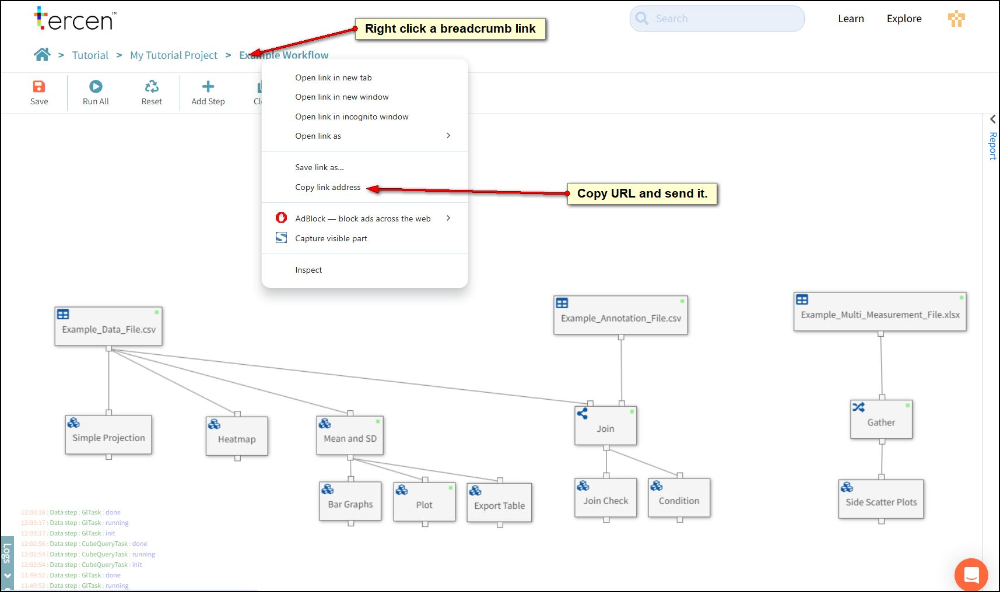
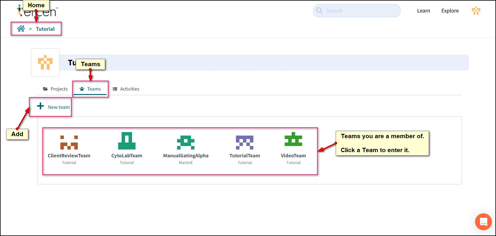
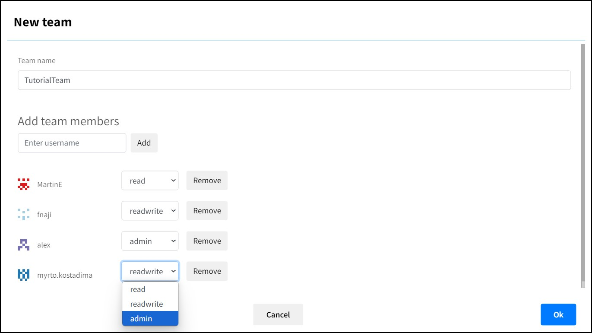
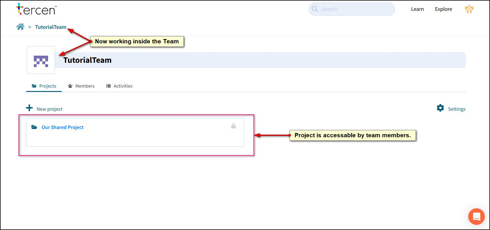

# Collaborating

Making projects public is a way of collaborating with others. Tercen has some more features that help.

## URL Links

Every location in Tercen has a URL reference. They are shown in the blue text on the breadcrumb and in the activity log. To take a colleague to an exact spot in a project, copy the URL and send it to them. Remember, they will need to be a member of your Team to be able to see it.

## Teams

Anybody can create a Team in Tercen.

Members of a Team can be added by their User Name or the email account they used to sign up.

Any projects created while inside the team will be visible to everybody in the team.

## Readme.md

Tercen creates a "Readme" notebook for each project. It is the display page for your project and can contain links to visualisations inside the workflow. The file is created with Markdown a lightweight scripting language.
