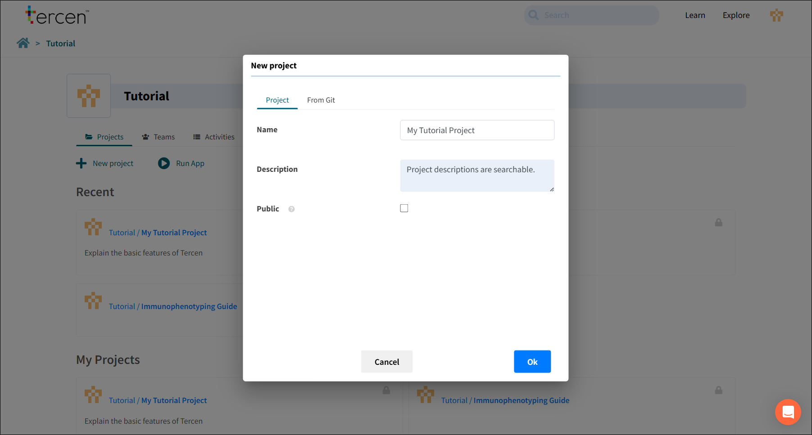
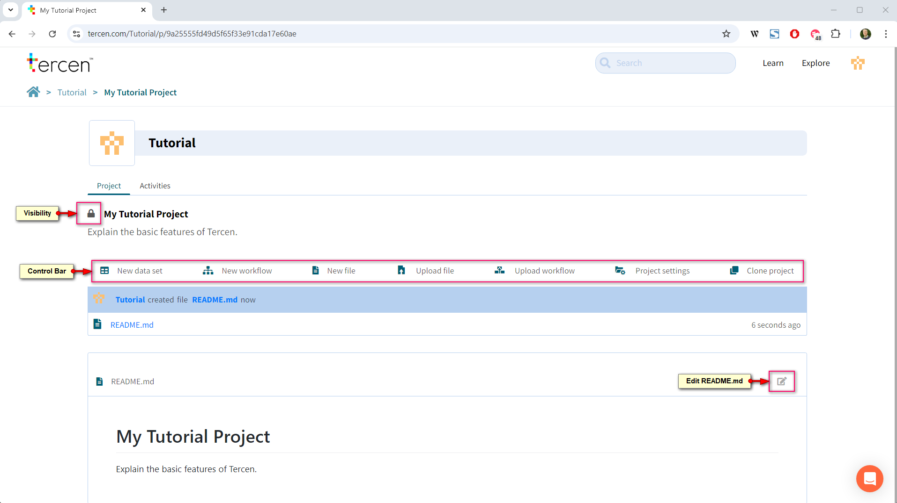

# Create a Project

Press the New Project button to create one.

- **Name:** The project name
- **Description:** This description will appear on the screen. The search bar will look for keywords in this section.
- **Visibility Setting:** Public means anybody on the Tercen server can see it.

The project will be visible in the **Explore** section of Tercen.
Unchecking the setting means only the owner (Person or Team) can see it.

A project is a repository for the elements of a data analysis. It contains Data Tables, Files, and Workflows.

## Header

- **Lock Icon:** Closed = Project is private.  Open = Project is public.
- **Activities Tab:** Activity log for this project.

## Control Bar

- **New Data Set:** The default method to Upload data files to Tercen.  
- **New Workflow:** Create a data analysis pipeline.
- **New file:** Create a text file for notes.
- **Upload file:** Upload non-data files to the project.
- **Upload workflow:** Upload a workflow exported from another project.
- **Project Settings:** Change Name, Description or Privacy Settings.
- **Clone Project:** Make a copy of this project for a new user or team. Anything with a clone icon can be copied to one of your projects or teams.
