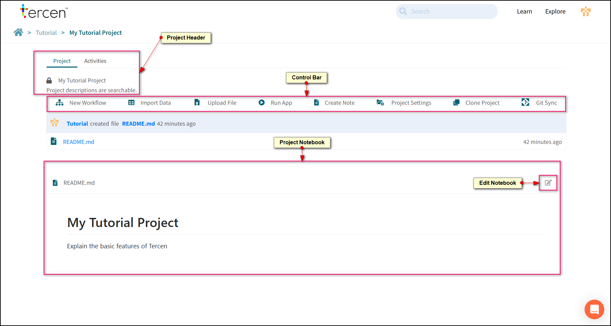

# Create a Project

## What is a project?

A project is a folder or repository which holds the data files, pipelines, and supplementary documents involved in the analysis.

## Start a New Project

Press the New Project button to create one.

- **Name:** The project name
- **Description:** Provide a short explanation of your project. The search bar will look for keywords in this section.
- **Public:** This is the visibility setting. Checked On means anybody on the Tercen server can see it. The project will be visible in the **Explore** section of Tercen. Unchecking the setting means only the owner (Person or Team) can see it.

A project is a repository for the elements of a data analysis. It contains Data Tables, Files, and Workflows.

## Project Header

- **Project Tab:**  The main work area for the project.
- **Activities Tab:** A log of actions performed in the course of the project.
- **Lock Icon:** Shows visibility setting. Closed = Project is private.  Open = Project is public.

## Control Bar

- **New Workflow:** Create a data analysis pipeline.
- **Import Data:** The default method to upload data files to Tercen. Files uploaded using this method are converted to Tercen Data Tables.
- **Upload File:** An alternative method to upload data files to Tercen. These files are not converted and must either be converted later in a workflow or handled directly by an operator.
- **Run App:** Launches your organisations project app.
- **Create Note:** Create a text file for notes.
- **Project Settings:** Change Name, Description or Privacy Settings.
- **Clone Project:** Make a copy of this project for a new user or team. Anything with a clone icon can be copied to one of your projects or teams.
- **Git Sync:** Tercen projects can be version controlled using Git or GitHub this feature allows synchronisation with a Git repo.

## Project Notebook

Tercen automatically creates a notebook called README.md for a new project. It will copy in the project name and description to begin and it can be edited from there.
