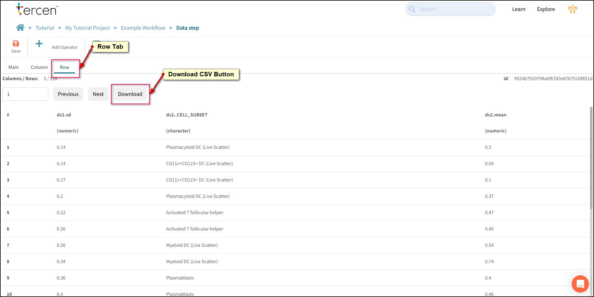

# Export Data Tables

You can use a Tercen projection to build new data sets using factors from uploaded tables and calculations made by operators.

These can be Exported easily and are useful for extracting simple data from complex files, perhaps for input to a downstream process.

Use the local toolbar to add a new Data Step to the **Mean and SD** step.

Clear the grid.

Perform the following projection.
> CELL_SUBSET to Row.  
> mean to Row.  
> sd to Row.  

!!! note
    Building an Export Table is one of the rare cases where the Y-Axis is not used.

Press the **Tables** Button to view the data in the projection.

Go to the **Rows** tab

Select **Download**

A CSV data file will be created and downloaded to your desktop.

Save the Data Step. Return to the Workflow Canvas and Rename it "Export Table."
