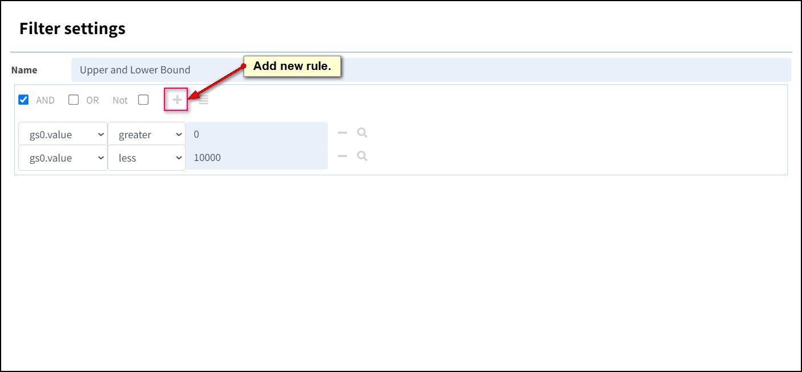

# Filter

Filters are a way of narrowing down the data projected in the crosstab grid.

Use them to control what is shown in a graph or sent to an operator for calculation.

Tercen filters use "Boolean Logic" which is based around the concept that all values are either true or false and, by asking enough true/false questions, you can get to any data point.

In Tercen a Filter is a list of rules built up in the settings.

Each rule has three parts.

- The **Factor** it is based on.
- A **Logic** for the rule to use.
- A piece of Data to **Define** the rule.

Scroll down our crosstab projection. See there is an irrelevant plot where SSC- A is being compared to itself. You will see all the data a points in a diagonal line.

Lets create a filter to remove it.

## Create a Filter

Drag **variable** and drop it on the **Filters** Zone.

The Filter settings screen will open.

Change the name to "Exclude Channels"

To remove the SSC-A channel we will build a rule as follows.
> Variable (Factor)  
> not equals  (Logic)  
> SSC-A (Definition)  

You can use the search icon to find individual data in a factor.

Click OK and check the crosstab projection. SSC-A is gone.

## Create a Filter Range

You can re-open a filter to modify it by clicking the Filter Zone chevron.

Multiple Filters can be created on a projection and filters can be made more complex with multi-line rules.

To exclude outlier values from the projection with a filter range drag **value** to filter.

Call this one “Upper and Lower Bound”

Build this rule.
> value (Factor)  
> greater (Logic)  
> 0 (Definition)  

Press plus to add a line

Build a second rule.
> value (Factor)  
> less (Logic)  
> 10000 (Definition)  

Press Ok and check the projection to see how it has changed.

_Note: Be aware that Filters apply their rules from the Top down. The top rule is applied first and then the next one, and so on, down the list. The rules at the top DO affect the rules that come after them.So it is possible for an earlier rule to exclude data that you expect a later filter to operate on._

Return to the workflow canvas and rename the step to "Side Scatter Plots".
