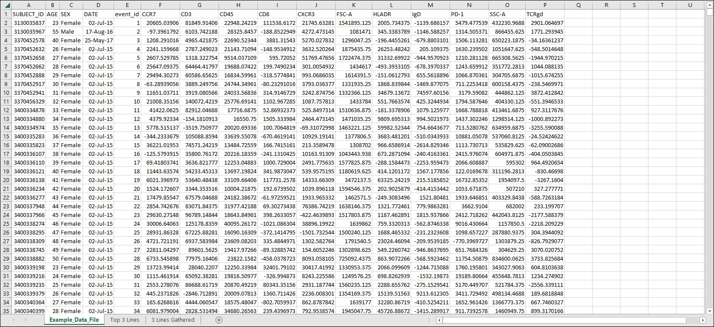
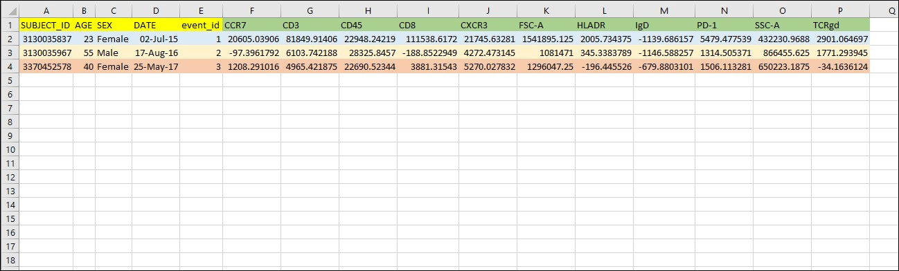
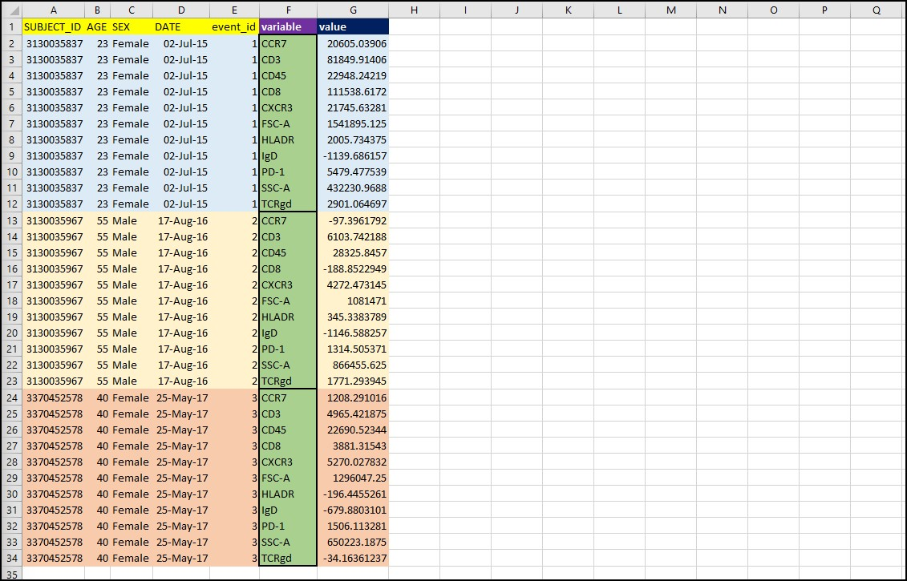
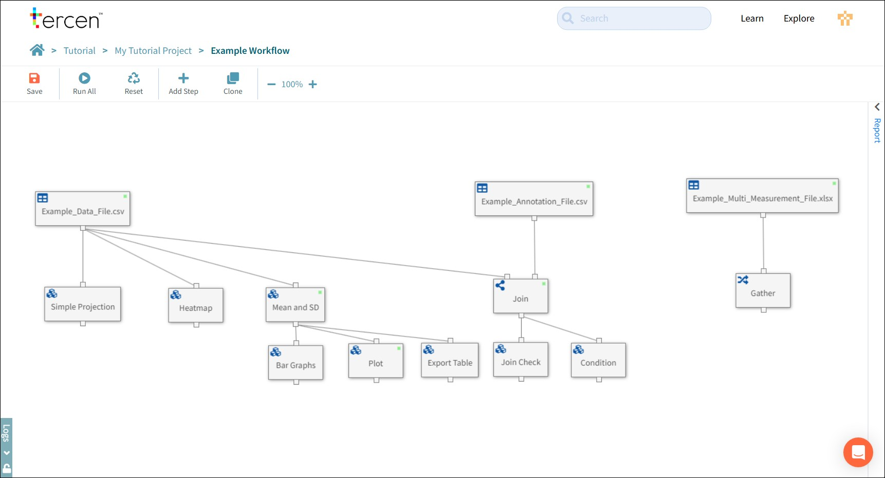
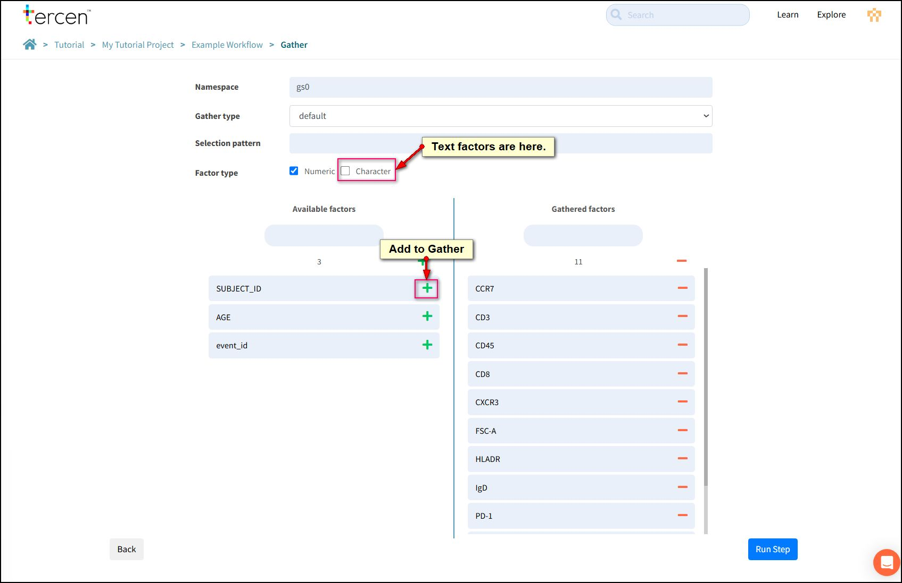
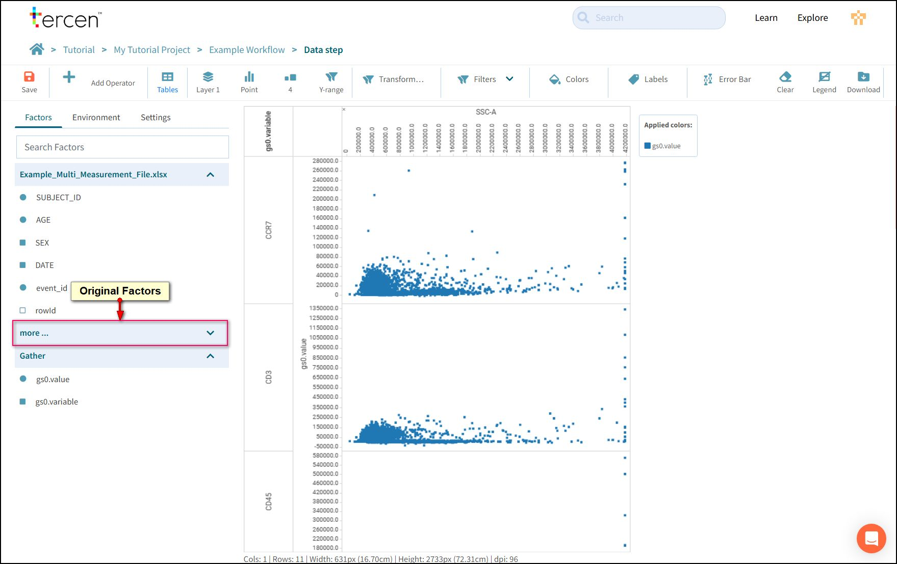

# Gather

## What is a Gather

Until this point we have used a file with a single **Main Measurement** called VALUE. We have expressed the importance of using the Main Measurement on the Y-Axis and followed this principle with all of our examples.

But, what if a file has more than one main measurement?

An operator might specify the Main Measurement on the Y-Axis and, if your file has more than one main measurement, it is possible to convert the format of the data to allow this.

This involves changing your data from Wide Format to Long Format.

The difference between wide data and long data is an important Data Analysis concept.

**Wide Data** is the traditional table format that you would see in a spreadsheet. Rows are individuals and columns tell you information about that individual. We get to a piece of information by visually cross referencing the row and column. Wide data is easy for humans to read but is difficult for computers to read.

**Long Data** is a list format with one piece of information (the measurement) per row and any descriptive information for the piece is repeated as many times as needed. Computers work faster with lists, they do not get bored reading the same information over and over again.

The conversion process to change wide format to long format is called a **Gather**.

## Examine the Data File

Download the [Example_Multi_Measurement_File](sample_files/Example_Multi_Measurement_File.xlsx) from this link.

Open it in your spreadsheet software.

This is a traditional Wide Format data file.

There is an identifier codes (SUBJECT_ID, event_id).
Some experimental data (AGE,SEX,DATE).
And multiple measurements (CCR7, CD3, CD45, CD8, CXCR3, FSC-A, HLADR, IgD, PD-1, SSC-A, TCRgd).

Click the **Before Gather** tab in the spreadsheet.

The top three lines of the spreadsheet are colour coded.

- **Yellow:** Factor names for ID codes and experimental data
- **Green:** Factor names for measurements
- **Blue, Beige, Orange:** Individual records with data.

Click the **After Gather** tab on the spreadsheet.

Each measurement has moved to an individual row and its column header becomes a label used to describe it.
The non-measurement data column headers are repeated as many times as needed on every row.

Note that two new Factor names (in purple) are created.

- **variable:** For the group of labels.
- **value:** For the group of measurements.

## Apply a Gather Step

Upload the Example_Multi_Measurement_File.xlsx to your project and add it to the workflow canvas.

!!! note
    This file is an Excel file. Remember to look for the correct importer.

Add a **Gather** Step from the local toolbar.

Open the Gather step.

Use the plus buttons to add the channel factors to the list to be gathered

Leave SUBJECT_ID, AGE and event_id to be un-gathered. They will be repeated on every row.

Click the **Run Step** button.

!!! note
    You may be wondering why SEX and DATE don't appear in the list. The factors are separated into Numeric and Character as text data can not be a main measurement.

## Projecting Gathered Data

Add a Data Step to the Gather from the local toolbar.

The new Factors **value** and **variable**  have been created. Value is a group of all the measurements and variable is a group of labels used to interpret them.

Make this projection.
_From Gather_
> Value to Y-Axis.  
> Variable to Row.  

A huge advantage to gathering your data is that multi-variate graphs are now possible.

Add to the projection.
_From Example_Multi_Measurement_File_
_Open the more... folder_
> SSC-A to X-Axis

Tercen will build a bi-variate plot of SSC-A against each of the gathered channels.

