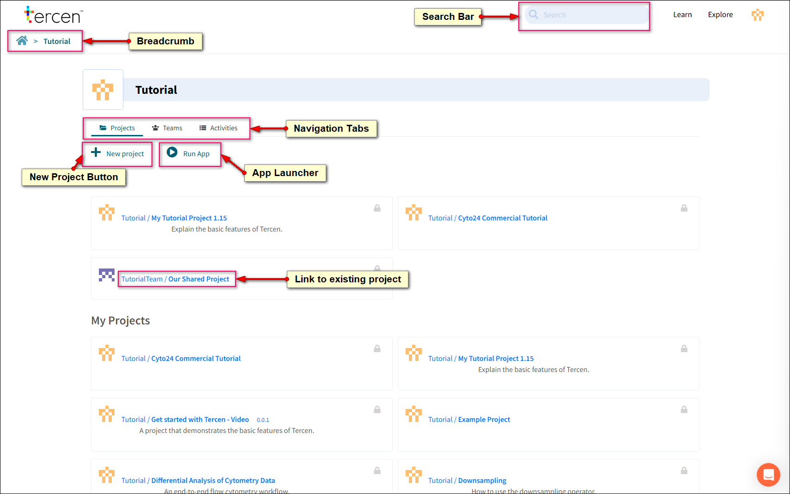

## Introduction

This tutorial aims to teach the basic skills, features, and techniques to begin using Tercen for data analysis.

## Topics Covered

- Navigate Tercen
- Upload Data
- Build an analysis Workflows
- Project and visualise data in the crosstab screen
- Perform calculations on data
- Export graphs and data tables.

_Note: Right click on a screenshot and open in a new tab to see a High Res version._

---

## Navigating Tercen

On log-in to Tercen you will be brought to your Home screen.

- **Breadcrumb:** A navigation chain. Each link leads to a location in Tercen. Click the home Icon to return to your personal page.
- **Tabs:** Projects, Teams, Team members, and the Activity Log can be accessed here. Blue Text denotes a clickable link.
- **New Project:**  A new project can be created from the Home page or from inside a Team. The creator (Home or Team) is the owner of the project.
- **Search Bar:** Projects, Workflows, Data Tables and Files can be searched. They must be owned by you or a Team you are a member of. Description text is included in the search but not contents of files.
