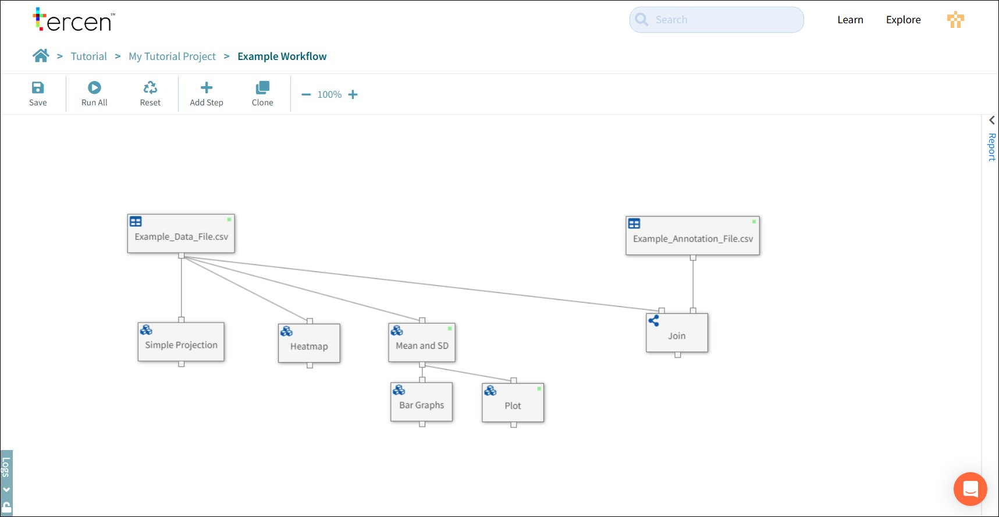
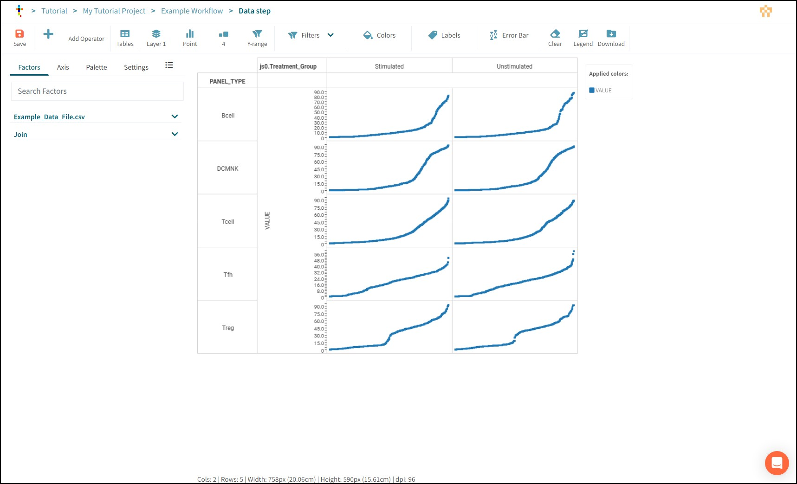

# Join

Tercen can combine data files and form a relational database inside your workflow.

## What is a Join

Databases relate information with codes called "keys". In simple terms, a "key" is a match made between two tables because they both contain a column with the same data in it.
There are many practical "keys" in a typical biology experiment. Obvious examples are Patient ID or Sample ID.

Earlier, when we checked our file, we saw it had the identification codes SUBJECT_ID and EXPERIMENT_ID.

Download the [Annotation File](sample_files/Example_Annotation_File.csv) from this link.

Open it with a spreadsheet.

The file contains information on the drug condition for our experiment. Notice that it also has a factor called EXPERIMENT_ID. This is the key we will use to join our example files.

_Tutorial Midpoint Test: Upload the Annotation file to your project and add it to the workflow canvas._

## Joining Tables

Click the Example_Annotation_File table on the workflow and add a Join from the Local Toolbar.
_Note: Select a RightTable if your Files location on the workflow canvas is to the right of the one you want to join to and LeftTable if it is to the left._

You will see a Join step has two nodes at the top, and one is already connected to your annotation file.

Click the free node on the top of the Join and then click the bottom node of the Example Data File table.

Edit the Join step.

The Factors of each table are displayed side by side. Matching the two together forms a key to the data.

Choose EXPERIMENT_ID from each table and click the Run Step button.

## Check a Join

Add data step to the Join.

Project the factors you picked for the **key** into the crosstab rows.

> EXPERIMENT_ID (From Example_Data_File.csv) to Row.  
> EXPERIMENT_ID (From Join) to Row.  

The crosstab will show all of the matches it has made.

If the Join column is blank, you will know the key has failed.

Return to the workflow canvas and rename the step to "Join Check"

## Projecting Joined Data

Now that the data files are joined, we can project from both and use the annotation file to provide extra context to the Example data.

Add a Data Step to the Join.

Perform the following projection.
_From Example Data File_
> VALUE to Y-Axis.  
> PANEL_TYPE to Row.  
_From Join_
> Treatment to Column.  

Save the Data Step and rename it to "Condition".
