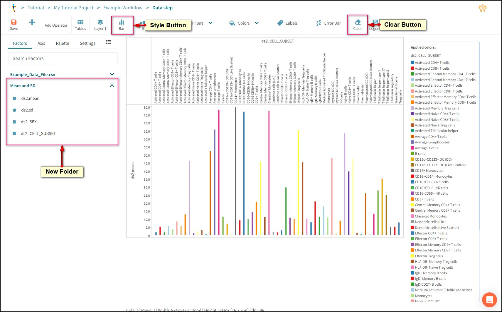
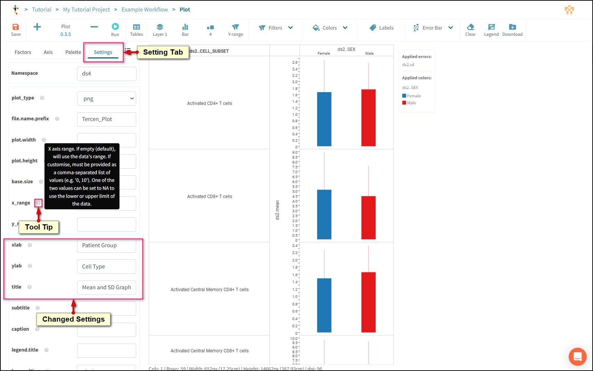

# Working with Operators

## What is an operator?

Operators are computer programs written in common languages such as R or Python. They perform calculations or visualisations on data and can be simple or complex depending on their design.

Tercen provides hundreds of standard operators to choose from, and your organization may even have created an operator specific to your experiment design.

## Add an Operator to a workflow

To add an operator to your pipeline, click the Data Table and select **Add** from the local toolbar.

Use the Operator Tag to filter and search for **Mean and SD** and press **OK**

A Data Step will open with the Mean and SD Operator loaded.

This operator will calculate a Mean and a Standard Deviation for every data cell.

## Operator Controls

- **Plus Button:** Add an operator into an existing step.
- **Name and Version:** The name of the operator and a version number 0.0.0 which links to instructions on how to use it.
- **Minus Button:** Removes the operator.
- **Run Button:** Locks the projection in the crosstab and runs the operator code on the data.

!!! note
    If Plus is pressed while an operator is already loaded Tercen will allow a new version of the same operator to be loaded without losing any settings you may have made on the old version. To go back to default settings use the minus button before adding again.

## How to set up an operator

Operators receive data from the crosstab projection.

They need the projection to be configured according to their internal design or they will not run properly.

To discover the projection an Operator expects, click the **version information link** under the operator's name.

This will take you to the operator's GitHub page, where layout instructions will be available in the README file.

- **Description:** Explains what the operators function is.
- **Input:** Specifies the crosstab projection that is required by the Operator.
    _Input Zone:_ The crosstab zone a factor can be placed in.
    _Factor Type:_ Operators may need a numeric or text input.
    _Status:_ Whether this zone must contain a factor or can be optionally left blank.
    _Description:_ Additional information to help pick an appropriate factor for this operator to get meaningful results.
- **Output:** Describes the outputs the Operator will create.
    _Factor Name:_ The name of the new factors that the operator will create to hold the results of its calculations.
    _Factor Type:_ What type of data the new factors will have such as numeric or text.
    _Calculation:_ When the operator runs, it performs one calculation per defined group. These can be Cells, Rows, Columns, or Whole Crosstab.
    _Description:_ A description of what the new factor is.

According to the specification, the **Mean and SD** operator expects the main measurement (VALUE in our example file) to be placed on the Y-Axis. It will make two calculations on every cell, a Mean and a Standard Deviation, and will create two new factors **mean** and **sd** to hold the results.

Return to Tercen.

## Run an Operator

Make the following projection.

> VALUE to Y-Axis.

Press the **Run Button** to start the operator.

An operators calculation time depends on the amount of data, complexity of the calculation, and the amount of compute power available to Tercen from the server. During the operators calculation time a Stop button will be available.

Upon completion a new buttons are added.

- **Reset Button:** The run button will change to a reset button when the code is finished. An operator must be reset before any changes to the projection can be made or re-runs of the operator performed.
- **Result Button:** Displays what the operator has created. This may be the results of a calculation or a specialized visualization.

Press the **Result Button** to review a data table with the operator's results.

The operator created two new factors **mean** and **sd** according to the spec. There is one calculation for each as there was one Data Cell in the projection.

!!! note
    Tercen automatically creates a **namespace** prefix to prevent duplicate Factor names from being created. They are based on the Object Type. For example, Data Steps generate "ds1." "ds2." and so on. Other steps have different namespaces.

## Adjusting an Operator

Operators can be modified and re-run.

Press the **Reset Button** to unlock the projection.

Drag some new groups into the projection.
> CELL_SUBSET to Row.  
> SEX to Column.  

**Run** the operator again and check the results.

Now, a Mean and a Standard Deviation (sd) have been calculated for all 118 cells in the crosstab (2 Columns, 59 Rows).

**Save** the Data Step.

Return to the Workflow Canvas.

## Project the results of an Operator

!!! note
    The Status Indicator on the  Mean and SD data step should be green.

To access the results of an operator's calculations, add a new data step to the Mean and SD step using the Local Toolbar.

!!! note
    The Tercen AI will attempt to help you by automatically creating a projection based on the Data Step you added the new step to. For this tutorial we will reject the suggestions and build each projection manually.

Press the **Clear** Button to re-set the crosstab grid.

The Factors Panel now has two folders.

The original folder with the Factors from the uploaded data file (Example_Data_File.csv) and a new one with the factors created by the Mean and SD operator.

!!! note
    The operator has created a mean factor and an sd factor according to the spec but there are other factors in this folder. These SEX and CELL_SUBSET were the factors we projected in the crosstab when we set up the operator. Tercen "carries down" an operators set-up in order to make further projections easier.

Make this projection.
> mean to Y-Axis.  
> CELL_SUBSET to X-Axis.  
> CELL_SUBSET to Colors.  
> Style Button to Bar.  

Save the Data step

Return to the Workflow Canvas

Rename the Data Step to "Bar Graphs"

## Plot Operator

Operators can generate visualizations as well as new Factors. To get more comprehensive and featureful graphs use the plot operator.

Add a Data Step to **Mean and SD** using the Local Toolbar

Use the Operators tag and Search to find the **Plot** operator.

When the Data Step opens. Clear the crosstab grid

Make the following projection.
> mean to Y-Axis.  
> CELL_SUBSET to Row.  
> SEX to X-Axis.  
> SEX to Colors.  
> sd to Error Bar.  
> Style Button to Bar.  

Operators can have settings that define parameters to modify how they process data. The settings are accessed by changing from **Factors** in the panel window to **Settings**.

The Plot operator settings define export file type, image sizes, labels for data, and more.

Each setting has a tooltip icon (?) with information on how to set parameters.

Find and set the following parameters.
> **xlab** to Patient Group.
> **ylab** to Cell Type.
> **title** to Mean and SD Graph.
> **wrap.1d** to False.
> **split_cells** to True.

Press the **Run** Button.

!!! note
    Images are rendered using standard Bioinformatics protocols as defined by the **ggplot** R package. The Operator has many settings that can significantly affect its look and performance.

They can be downloaded individually or batched together in a ZIP file. Just click the relevant link.

Save the Data Step and return to the workflow canvas.

## Workflow Report Panel

The Plot operator can be used as many times as necessary and each one passes its results into the Workflow report panel.

This panel builds up a comprehensive report from all the Plot Operators in the workflow.
