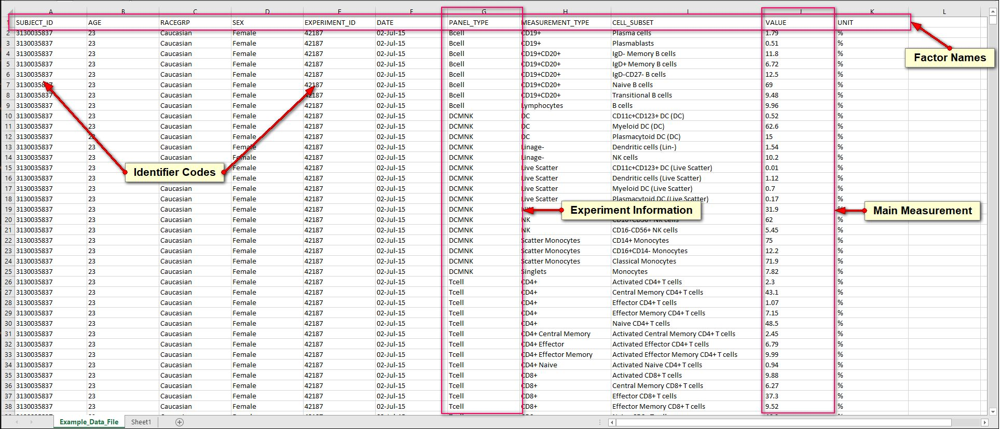
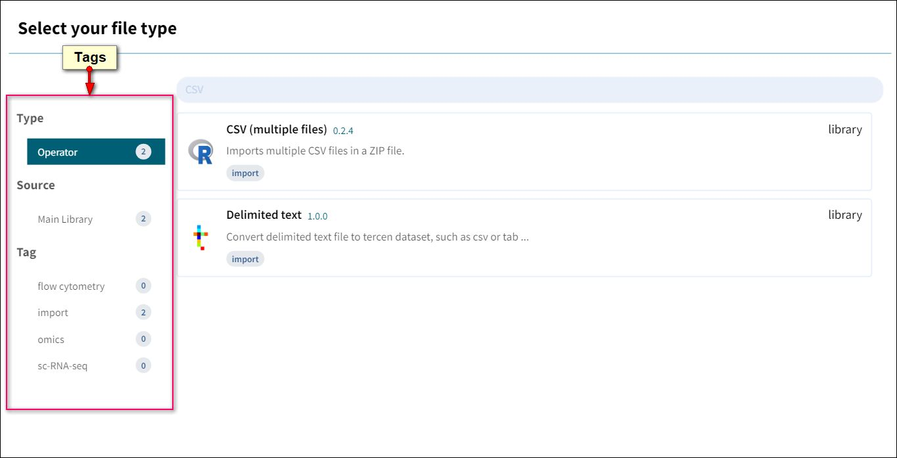
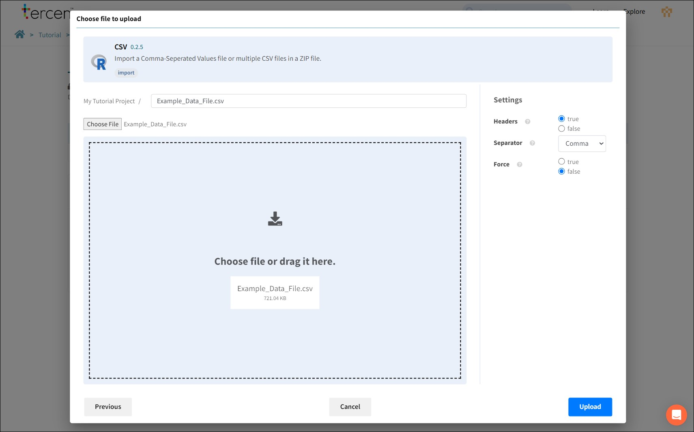

# Upload Data

Tercen can upload and analyse any scientific data. This tutorial provides some sample files to explain the concepts.

## Download Tutorial Files

Download the example file from this link.
[Data File](sample_files/Example_Data_File.csv).

## Examine the Data

Open Example_Data_File.csv in a spreadsheet program.

This data set has 127 Patients where multiple measurements were taken at different time points over the course of the experiment. The data file contains

- **Factors:** Column headers of a spreadsheet become Factor names in Tercen. Factors are "pots" of data (containing everything in the column) that Tercen can project and calculate on.  
- **Identifier Codes:** Unique identifier numbers for Patients, Samples, Experimental Conditions and many other elements. These ID codes are used to protect anonymity and link to Meta Data files with further information on each element.
- **Experimental Data:** Ordinary information. This file contains some patient data (AGE, RACEGRP, SEX) and some experiment data (PANEL_TYPE, MEASUREMANT_TYPE, CELL SUBSET)
- **Measurement:** A data file can have one or more measurements to be plotted in graphs. Identifying the Main Measurement is an important concept, as analysis usually starts with this and expands from there.

---

## Upload to Tercen

Tercen uploads data files using importers. They are specific to the file type being uploaded.

Press the **Import Data** button.

Our example file is a CSV file (.csv).

Search for CSV, select it and press Next.

Tags can be pressed to filter options in the search.

Drag and drop from your file explorer or use the browse button to select `Example_Data_File.csv`.

Press the **Upload** button to proceed.

When Tercen uploads files, it converts them into a Dynamic Table.

Dynamic Tables allow Tercen to perform calculations and mix data from incompatible file types.
