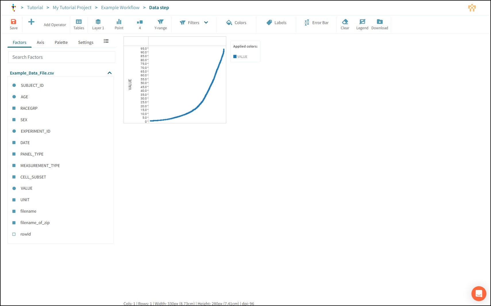

# Basic Analysis: Workflow

## What is a workflow?

Workflows are pipelines that process data, perform calculations on it, make visualizations, and create reports.

Press the **New Workflow** button

Name the workflow (for example "Example Workflow").

NOTE: Pre-defined workflows can be selected here. These are called Templates. Templates are used to standardize pipelines so that the set-up for routine analysis is speeded up and repeatability is ensured by using the same analysis steps for each experiment.

Typically a Tercen analysis would start with a Template, but, for the purpose of this training exercise we will NOT select a template at this point

Press **Ok**

The Workflow Canvas will load.

- **Save:** Will turn orange when there is a change to save.
- **Run All:** Runs each step in the workflow sequentially until all have completed or failed.
- **Reset** Unlocks a run-completed workflow so it can be modified.
- **Add Step** Add an independent Step to the workflow. Use this to start a pipeline.
- **Clone** Takes a copy of the workflow and recreates it in a different project.
- **Size Control** Adjust the zoom view of the canvas.

## Connect Data: Table Step

Start a pipeline by pressing the **Add Step** button.

Choose the **Table** Step and press Ok

Select the uploaded **Example_Data_File.csv** file from **Current Project** and press Ok.

_Note: Data Tables uploaded to the Main Library of Tercen are available to every project on the server. Normally, these are reference data sets for calibration._

The data table is loaded to the workflow canvas. To extend the pipeline, click the step to bring up the Local Toolbar.

- **Reset:** Resets this step and any dependent steps in the pipeline. Previous steps are not reset.
- **Edit:** Opens this step to expose its features and settings.
- **Rename:** Change the step name.
- **Remove:** Deletes the step.
- **Duplicate:** Makes a copy of the step linked to the same previous data.
- **Add:** Adds a new step, downstream from this step.
- **Status Indicator:** Green when that Data Step has run successfully. Red if there is a problem.

## Define an Analysis: Data Step

Press the **Add** button.

Choose the **Data Step** option and press Ok.

The Data Step will open automatically.

Data Steps are the main engine blocks of analysis in Tercen. Visualizations and Calculations are set up and performed here.

- **Control Bar:** Features for data manipulation and visualization.
- **Factors Panel:** Column headers from the data file appear as Factors at the beginning of this list. As the pipeline is built folders will be added containing any new Factors that are created by any calculations the pipeline makes. Each Data Step has access to the factors of the steps that precede it in the pipeline.
- **Crosstab Grid:** Factors are dropped onto this grid to make projections. These projections create the base data set that is used to create visualizations and perform calculations.

## Make an X-Y Axis projection

Drag VALUE out of the Factors panel with your mouse.

The areas where it can be dropped will go green.

The crosstab grid has an X-axis and a Y-axis, which project numbers.

It also has Rows and Columns, which are used to perform groupings of the data projected in the X and Y Axes.

We recommend that you always start a projection with your primary measurement on the Y-axis.

Drop VALUE on the Y-axis.

The crosstab builds a Data Cell with all the measurements in the VALUE factor ordered from lowest to highest.

_Note: Unlike a spreadsheet data cell, a Tercen data cell can hold multiple data points. This important concept impacts how a calculation or visualization is performed._

Drag CELL_SUBSET to X-Axis to make a simple projection.

Grab the black lines of the crosstab grid and drag them out to make the data more visible.

Hold the **CTRL** key on your keyboard and scroll with the mouse wheel to zoom in and out.

Press Save and return to the workflow canvas by clicking the breadcrumb.

Click the data Step to bring up the Local toolbar and rename this Data Step to "Simple Projection".

Save the workflow.

## Make a Row/Column projection

Click the Data Table and add a new Data Step from the Local Toolbar.

When Factors are dropped to columns or Rows, the crosstab splits the data cell into groups of data points according to that factor. These new data cells have their own X-Y Axis.

Multiple Factors can be dropped to Rows and Columns, forming subgroups. A black line will appear on either side of a Row or Column indicating whether a Factor will be dropped before or after the existing one.

Groupings on a Crosstab projection work from Outside to In. For Columns, the topmost factor is grouped first, and then sub-groups in order below it. For Rows, the leftmost factor is grouped first, and then subsequent factors working to the right.

Make the following projection.

> VALUE to Y-Axis.  
> SEX to Column.  
> AGE to Column (after SEX).  
> CELL_SUBSET to Row.  
> PANEL_TYPE to Row (before CELL_SUBSET).  

Save the Data Step.

## Make a Heatmap

The Control Bar has buttons and Zones to control how a projection is visualized.

- **Buttons:** Apply a pre-defined change to the data such as point size, style, or clear the grid.
- **Zones:** Light up green and apply a change to the data that is defined by the Factor that is dropped onto it. These are Filters, Colors, Labels, and Error Bar.

Adjust the projection as follows.
> SUBJECT_ID to Column (After AGE).  
> VALUE to Colors.  

The crosstab grid now has one data cell per measurement and they are coloured according to their VALUE with low numbers trending towards blue and high numbers trending towards Red.

Press the Style button and change it from **Point** to **Heatmap**.

Take a moment to move the black lines and zoom in to examine the data. Try to look for immunological patterns.

## Adjust the Colour Palette

Tercen has further colour control options for visualizations made with the crosstab.

Select **Palette** from the Factors Panel.

Palette options are available in the dropdown.

Selected Options will have further settings to adjust the colour controls.

Experiment with the choices on offer.

Select the Divergent palette and adjust the min/max boundary. Press teh plus button to apply your changes.

Click the colour panes and reset them.

## Take a Snapshot

Tercen can take a quick snapshot of the visualization in the crosstab grid and export it as a **.png** image file.

Press the **Download** button to export the heatmap.

_Note: This feature will only export what it sees on screen. If the crosstab is longer than the bottom of your screen those parts will not be imaged. Adjust the black lines to get a better image or follow the tutorial to learn how to use the Plot operator._

## Save and Rename

Save the Data Step.

Return to the workflow canvas and rename the data step "Heatmap".

Grab Data Steps and move them on the canvas with your mouse.

Save the workflow.

