# Tutorial

---

## Introduction

This tutorial explains how to navigate the Tercen interface and teaches basic skills for data analysis using Tercen.

### Topics Covered

- Navigate Tercen
- Upload Data
- Build an analysis Workflows
- Project and visualise data in the crosstab screen
- Perform calculations on data
- Export graphs and data tables.

Note: Right click on a screenshot and open in a new tab if a High Res version is needed.

---

## Video Tutorial

A video tutorial is available at this link. It walks through exercises to illustrate the basic skills for analysing data in Tercen.

<iframe src="https://player.vimeo.com/video/932148936?badge=0&amp;autopause=0&amp;player_id=0&amp;app_id=58479" frameborder="0" allow="autoplay; fullscreen; picture-in-picture; clipboard-write" style="position:absolute;top:0;left:0;width:100%;height:100%;" title="Get Started With Tercen"></iframe>

---

## Navigating Tercen

On log-in to Tercen you will be brought to your Home screen.
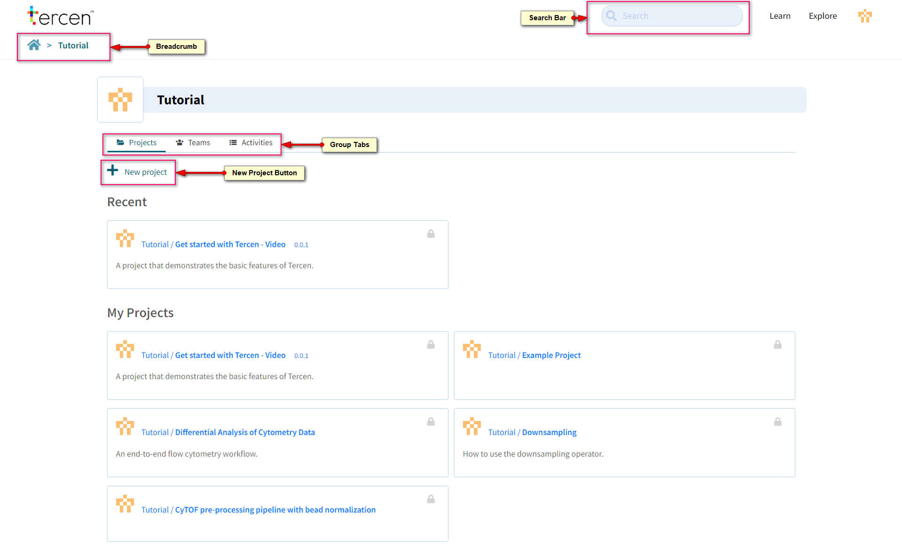

- **Breadcrumb:** A navigation chain. Each link leads to a location in Tercen. Click the home Icon to return to your personal page.
- **Tabs:** Projects, Teams, Team members, and the Activity Log can be accessed here. Blue Text denotes a clickable link.
- **New Project:**  A new project can be created from the Home page or from inside a Team. The creator (Home or Team) is the owner of the project.
- **Search Bar:** Projects, Workflows, Data Tables and Files can be searched. They must be owned by you or a Team you are a member of. Description text is included in the search but not contents of files.

---

## Create a Project

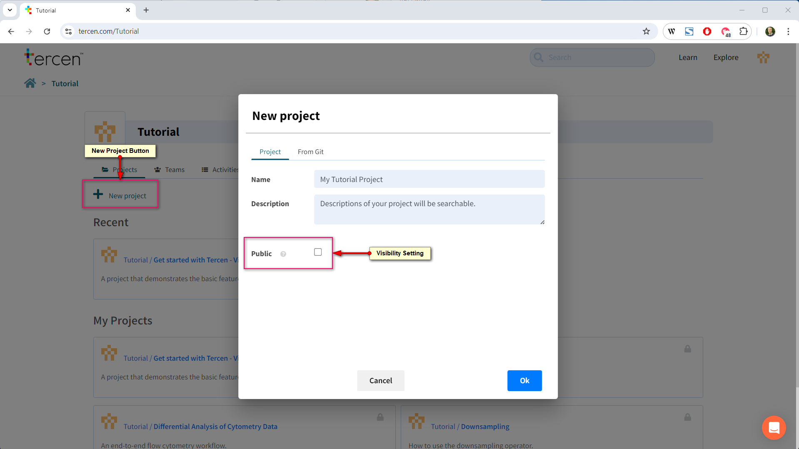

Press the New Project button to create one.

- **Name:** The project name
- **Description:** This description will appear on screen. The search bar will look for keywords in this section.
- **Visibility Setting:** Public means anybody on the Tercen server can see it.
The project will be visible in the **Explore** section of Tercen.
Unchecking the setting means only the owner (Person or Team) can see it .

A project is a repository for the elements of a data analysis. It contains Data Tables, Files and workflows.
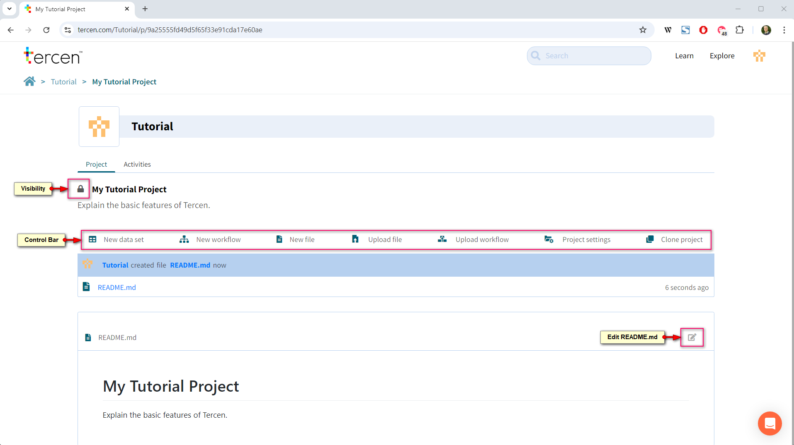

### Header

- **Lock Icon:** Closed = Project is private.  Open = Project is public.
- **Activities Tab:** Activity log for this project.

### Control Bar

- **New Data Set:** The default method to Upload data files to Tercen.  
- **New Workflow:** Create a data analysis pipeline.
- **New file:** Create a text file for notes.
- **Upload file:** Upload non-data files to the project.
- **Upload workflow:** Upload a workflow which was exported from another project.
- **Project Settings:** Change Name, Description or Privacy Settings.
- **Clone Project:** Make a copy of this project for a new user or team. Anything with a clone icon can be copied to one of your projects or teams.

### Readme.md

Tercen creates a "Readme" notebook for each project. It is the display page for your project and can contain links to visualisations inside the workflow. The file is created with Markdown a lightweight scripting language.

---

## Upload Data

Tercen can upload any scientific data and analyse it. This tutorial provides some sample files to explain the concepts.

## Download Tutorial Files

Download the example files from these links.
[Data File](sample_files/Example_Data_File.csv).
[Annotation File](sample_files/Example_Annotation_File.csv).

### Examine the Data

Open Example_Data_File.csv in a spreadsheet program.
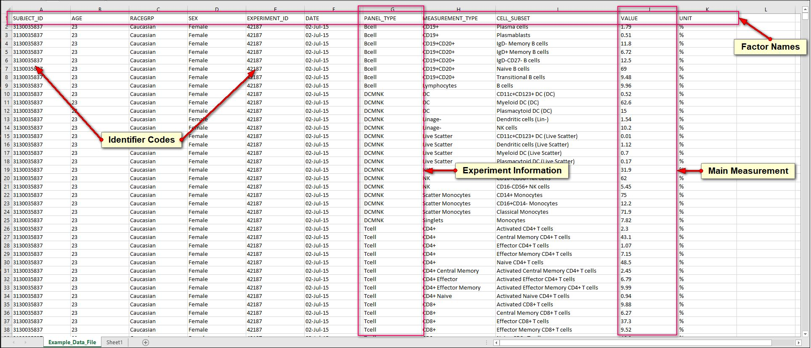

This data set has 127 Patients where multiple measurements were taken at different time points over the course of the experiment. The data file contains

- **Factors:** Column headers of a spreadsheet become Factor names in Tercen. Factors are "pots" of data (containing everything in the column) that Tercen can project and calculate on.  
- **Identifier Codes:** Unique identifier numbers for Patients, Samples, Experimental Conditions and many other elements. These ID codes are used to protect anonymity and link to Meta Data files with further information on that element.
- **Experimental Data:** Ordinary information. This file contains some patient data (AGE, RACEGRP, SEX) some experiment data (PANEL_TYPE, MEASUREMANT_TYPE, CELL SUBSET)
- **Measurement:** A data a file can have one or more measurement to be plotted in graphs. Identifying the Main Measurement is an important concept as analysis usually starts with this and expands from there.

---

## Uploading Data

Tercen uploads data files using importers. They are specific to the file type being uploaded.

Press the **New Data Set** button.

Our example file is a CSV file (.csv).

Search for CSV, select it and press Next.

Tags can be pressed to filter options in the search.

Use Drag and drop from your file browser or the browse button to select Example_Data_File.csv.

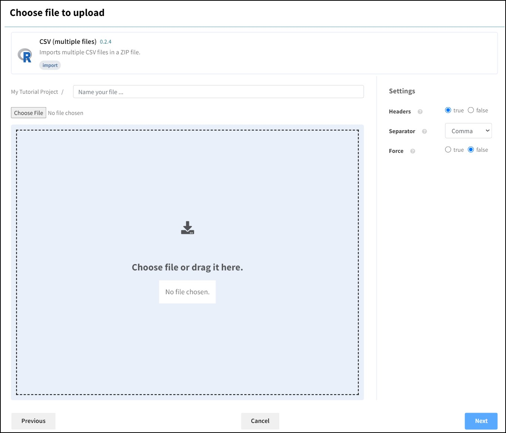

Press Next to upload it.

When Tercen uploads files it converts them to a Dynamic Table.

Dynamic Tables allow Tercen to perform calculations and mix data from incompatible file types.

---

## Analyse Data with a Workflow

Workflows are pipelines that process data, perform calculations on it, make visualisations and create reports.

Press the **New workflow** button

Name the workflow. (for example "Example Workflow")

Press **Next**

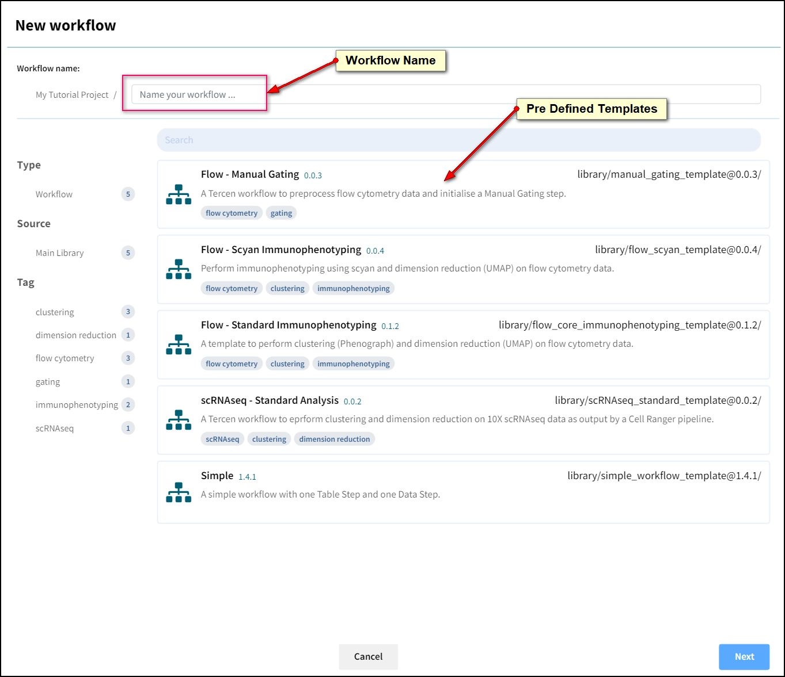

_Note: Pre-defined workflows can be selected. These are called Templates. Templates are used to standardise pipelines to perform routine analysis or ensure repeatability by following the same analysis steps for each experiment._

The Workflow Canvas will load.

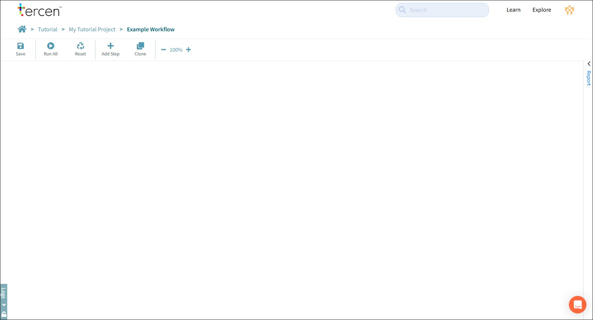

- **Save:** Will turn orange when there is a change to save.
- **Run All:** Runs each step in the workflow sequentially until all have completed or failed.
- **Reset** Unlocks a run-completed workflow so it can be modified.
- **Add Step** Add an independent Step to the workflow. Use this to start a pipeline.
- **Clone** Takes a copy of the workflow and recreates it in a different project.
- **Size Control** Adjust zoom view of the canvas.

### Table Step

Start a pipeline by pressing the **Add Step** button.

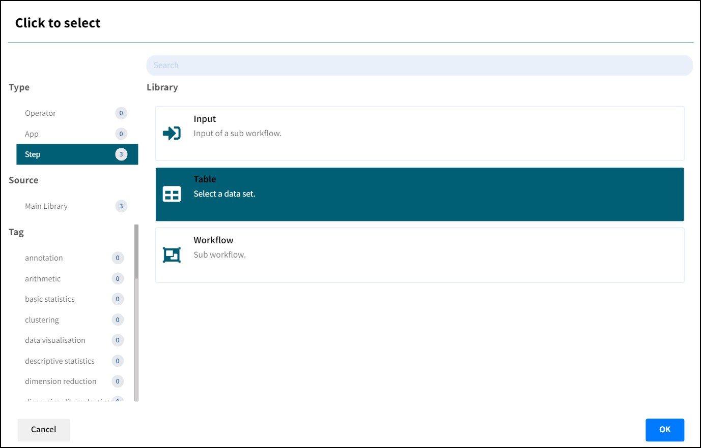

Choose the **Table** Step and press Ok

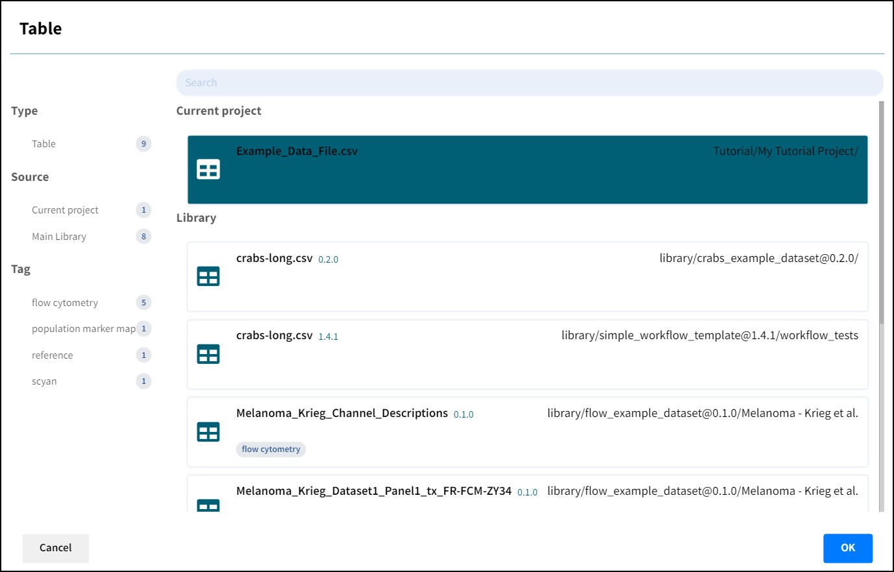

Select the uploaded **Example_Data_File.csv** file from **Current Project** and press Ok.

_Note: Data Tables uploaded to the Main Library of Tercen are available to every project on the server. Normally these are reference data sets for calibration._

The data table is loaded to the workflow canvas. Extend the pipeline by clicking the step to bring up the **Local Toolbar**.

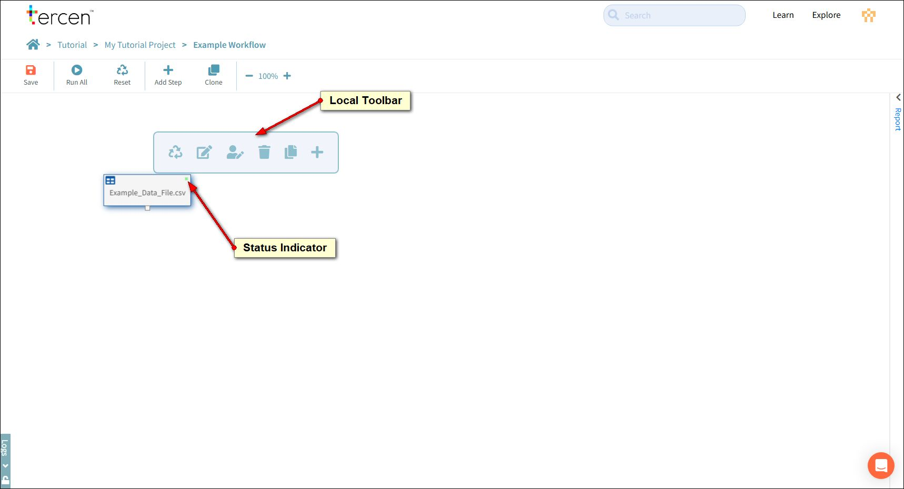

- **Reset:** Resets this step and any dependent steps in the pipeline. Previous steps are not reset.
- **Edit:** Opens this step to expose its features and settings.
- **Rename:** Change the step name.
- **Delete:** Removes the step.
- **Duplicate:** Makes a copy of the step linked to the same previous data.
- **Add:** Adds a new step, downstream from this step.

### Data Step

Press the **Add** button.

Choose the **Data Step** option and press Ok.

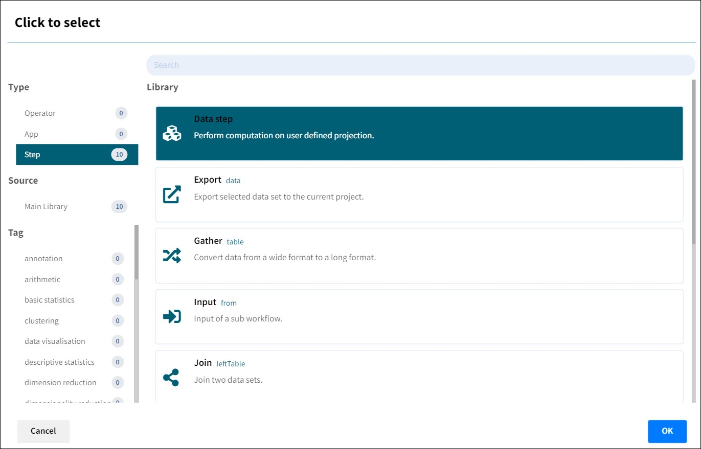

The Data Step will open automatically.

Data Steps are the main engine blocks of analysis in Tercen. Visualizations and Calculations are set up and performed here.

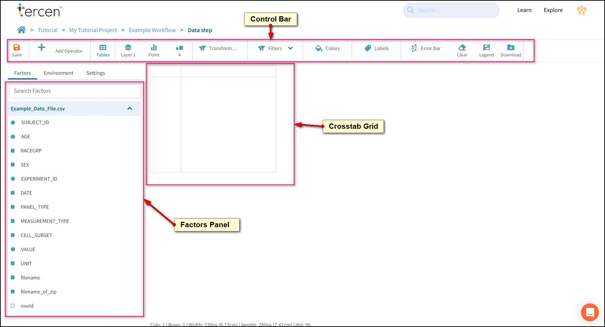

- **Control Bar:** Features for data manipulation and visualisation.
- **Factors Panel:** Factors from the data file appear at the beginning of this list. As the pipeline is built folders are added containing the new factors that are created by the calculations it makes. Each Data Step has access to the factors of the steps that precede it in the pipeline.
- **Crosstab Grid:** Factors are dropped onto this grid to make projections. These projections create the base data set that is used to create visualisations or perform calculations.

### Make an X-Y Axis projection

Drag VALUE out of the Factors panel with your mouse.

The areas it can be dropped will go green.

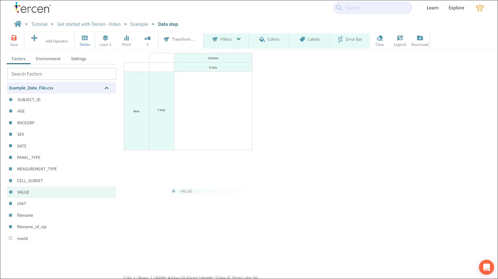

The crosstab grid will offer an X-Axis and a Y-Axis, which project numbers.

It will offer Row and Column which are used to form groupings of the data in the X-Y Axes.

We recommend that you always start a projection with your main measurement in the Y-Axis.

Drop VALUE on the Y-Axis.

The crosstab builds a Data Cell with all the measurements in the VALUE factor ordered from lowest to highest.

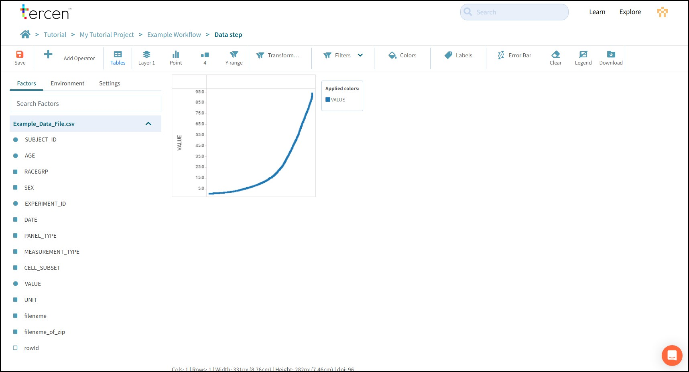

_Note: Unlike a spreadsheet data cell, a Tercen data cell can hold multiple data points. This is an important concept that impacts how a calculation or visualisation is performed._

Drag CELL_SUBSET to X-Axis to make a simple projection.

Grab the black lines of the crosstab grid and drag them out to make the data more visible.

Hold the **CTRL** key on your keyboard and scroll with the mouse wheel to zoom in and zoom out.

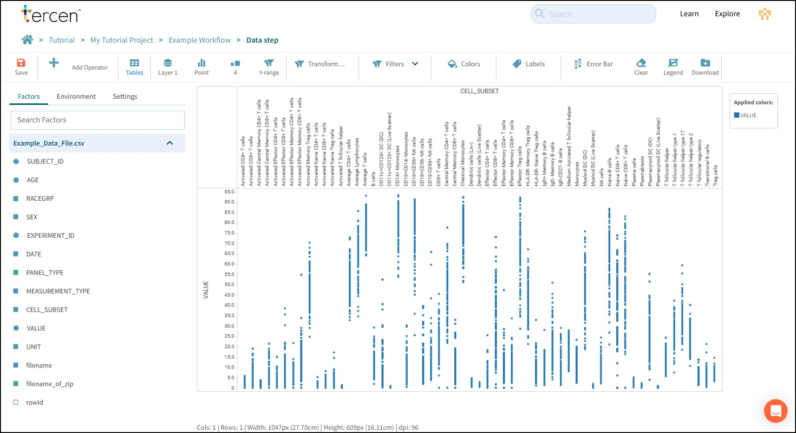

Press Save and return to the workflow canvas by clicking the breadcrumb.

Click the data Step to bring up the Local toolbar and rename this Data Step to "Simple Projection".

Save the workflow.

### Make a Row/Column projection

Click the Data Table and add a new Data Step from the Local Toolbar.

When Factors are dropped to columns or Rows the crosstab will split the data cell into groups of data points according to that factor. These new data cells have their own X-Y Axis.

Multiple Factors can be dropped to Rows and Columns forming sub groups. A black line will appear either side of a Row or Column indicating whether a Factor will be dropped before or after the existing one.

Groupings on a Crosstab projection work from Outside to In. For Columns, the topmost factor is grouped first, and then sub-groups in order below it. For Rows, the leftmost factor is grouped first, and then subsequent factors working to the right.

Make the following projection.

> VALUE to Y-Axis
> SEX to Column
> AGE to Column (after SEX)
> CELL_SUBSET to Row
> PANEL_TYPE to Row (before CELL_SUBSET)

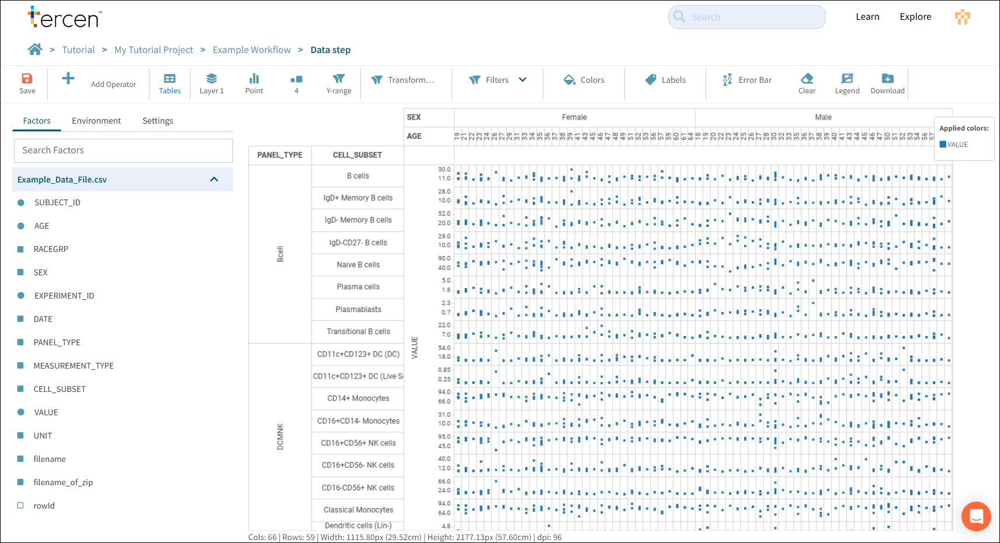

Save the Data Step.

### Make a Heatmap

The Control Bar has buttons and Zones to control how a projection is visualized.

- **Buttons:** Apply a pre-defined change to the data such as point size, style, or clear the grid.
- **Zones:** Light up green and apply a change to the data that is defined by the Factor that is dropped onto it. These are Filters, Colors, Labels, and Error Bar.

Adjust the projection as follows.
> SUBJECT_ID to Column (After AGE)
> VALUE to Colors

The crosstab grid now has one data cell per measurement and they are colored according to their VALUE with low numbers trending towards blue and high numbers trending towards Red.

Press the Style button and change it from **Point** to **Heatmap**.

Take a moment to move the black lines and zoom in to examine the data. Try to look for immunological patterns.

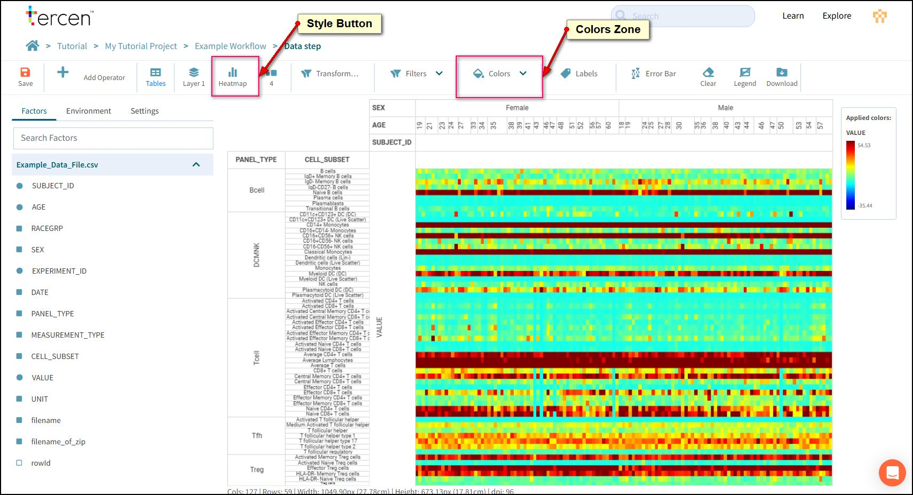

Save the Data Step, return to the workflow canvas and rename the data step "Heatmap".

Grab Data Steps and move them on the canvas with your mouse.

### Working with Operators
