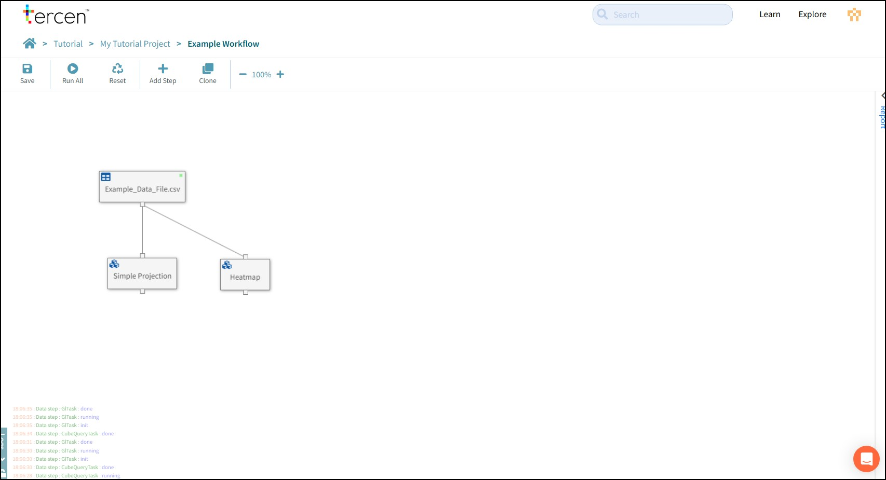

# Tutorial

---

## Introduction

This tutorial explains how to navigate the Tercen interface and teaches basic skills for data analysis using Tercen.

### Topics Covered

- Navigate Tercen
- Upload Data
- Build an analysis Workflows
- Project and visualise data in the crosstab screen
- Perform calculations on data
- Export graphs and data tables.

Note: Right click on a screenshot and open in a new tab if a High Res version is needed.

---

## Navigating Tercen

On log-in to Tercen you will be brought to your Home screen.

- **Breadcrumb:** A navigation chain. Each link leads to a location in Tercen. Click the home Icon to return to your personal page.
- **Tabs:** Projects, Teams, Team members, and the Activity Log can be accessed here. Blue Text denotes a clickable link.
- **New Project:**  A new project can be created from the Home page or from inside a Team. The creator (Home or Team) is the owner of the project.
- **Search Bar:** Projects, Workflows, Data Tables and Files can be searched. They must be owned by you or a Team you are a member of. Description text is included in the search but not contents of files.

---

## Create a Project

Press the New Project button to create one.

- **Name:** The project name
- **Description:** This description will appear on screen. The search bar will look for keywords in this section.
- **Visibility Setting:** Public means anybody on the Tercen server can see it.
The project will be visible in the **Explore** section of Tercen.
Unchecking the setting means only the owner (Person or Team) can see it .

A project is a repository for the elements of a data analysis. It contains Data Tables, Files and workflows.

### Header

- **Lock Icon:** Closed = Project is private.  Open = Project is public.
- **Activities Tab:** Activity log for this project.

### Control Bar

- **New Data Set:** The default method to Upload data files to Tercen.  
- **New Workflow:** Create a data analysis pipeline.
- **New file:** Create a text file for notes.
- **Upload file:** Upload non-data files to the project.
- **Upload workflow:** Upload a workflow which was exported from another project.
- **Project Settings:** Change Name, Description or Privacy Settings.
- **Clone Project:** Make a copy of this project for a new user or team. Anything with a clone icon can be copied to one of your projects or teams.

### Readme.md

Tercen creates a "Readme" notebook for each project. It is the display page for your project and can contain links to visualisations inside the workflow. The file is created with Markdown a lightweight scripting language.

---

## Upload Data

Tercen can upload any scientific data and analyse it. This tutorial provides some sample files to explain the concepts.

### Download Tutorial Files

Download the example file from this link.
[Data File](sample_files/Example_Data_File.csv).

### Examine the Data

Open Example_Data_File.csv in a spreadsheet program.

This data set has 127 Patients where multiple measurements were taken at different time points over the course of the experiment. The data file contains

- **Factors:** Column headers of a spreadsheet become Factor names in Tercen. Factors are "pots" of data (containing everything in the column) that Tercen can project and calculate on.  
- **Identifier Codes:** Unique identifier numbers for Patients, Samples, Experimental Conditions and many other elements. These ID codes are used to protect anonymity and link to Meta Data files with further information on that element.
- **Experimental Data:** Ordinary information. This file contains some patient data (AGE, RACEGRP, SEX) some experiment data (PANEL_TYPE, MEASUREMANT_TYPE, CELL SUBSET)
- **Measurement:** A data a file can have one or more measurement to be plotted in graphs. Identifying the Main Measurement is an important concept as analysis usually starts with this and expands from there.

---

### Upload to Tercen

Tercen uploads data files using importers. They are specific to the file type being uploaded.

Press the **New Data Set** button.

Our example file is a CSV file (.csv).

Search for CSV, select it and press Next.

Tags can be pressed to filter options in the search.

Use Drag and drop from your file browser or the browse button to select Example_Data_File.csv.

Press Next to upload it.

When Tercen uploads files it converts them to a Dynamic Table.

Dynamic Tables allow Tercen to perform calculations and mix data from incompatible file types.

---

## Analyse Data with a Workflow

Workflows are pipelines that process data, perform calculations on it, make visualisations and create reports.

Press the **New workflow** button

Name the workflow. (for example "Example Workflow")

Press **Next**

_Note: Pre-defined workflows can be selected. These are called Templates. Templates are used to standardise pipelines to perform routine analysis or ensure repeatability by following the same analysis steps for each experiment._

The Workflow Canvas will load.

- **Save:** Will turn orange when there is a change to save.
- **Run All:** Runs each step in the workflow sequentially until all have completed or failed.
- **Reset** Unlocks a run-completed workflow so it can be modified.
- **Add Step** Add an independent Step to the workflow. Use this to start a pipeline.
- **Clone** Takes a copy of the workflow and recreates it in a different project.
- **Size Control** Adjust zoom view of the canvas.

### Table Step

Start a pipeline by pressing the **Add Step** button.

Choose the **Table** Step and press Ok

Select the uploaded **Example_Data_File.csv** file from **Current Project** and press Ok.

_Note: Data Tables uploaded to the Main Library of Tercen are available to every project on the server. Normally these are reference data sets for calibration._

The data table is loaded to the workflow canvas. Extend the pipeline by clicking the step to bring up the **Local Toolbar**.

- **Reset:** Resets this step and any dependent steps in the pipeline. Previous steps are not reset.
- **Edit:** Opens this step to expose its features and settings.
- **Rename:** Change the step name.
- **Delete:** Removes the step.
- **Duplicate:** Makes a copy of the step linked to the same previous data.
- **Add:** Adds a new step, downstream from this step.
- **Status Indicator:** Green when that Data Step has run successfully. Red if there is a problem.

### Data Step

Press the **Add** button.

Choose the **Data Step** option and press Ok.

The Data Step will open automatically.

Data Steps are the main engine blocks of analysis in Tercen. Visualizations and Calculations are set up and performed here.

- **Control Bar:** Features for data manipulation and visualisation.
- **Factors Panel:** Factors from the data file appear at the beginning of this list. As the pipeline is built folders are added containing the new factors that are created by the calculations it makes. Each Data Step has access to the factors of the steps that precede it in the pipeline.
- **Crosstab Grid:** Factors are dropped onto this grid to make projections. These projections create the base data set that is used to create visualisations or perform calculations.

### Make an X-Y Axis projection

Drag VALUE out of the Factors panel with your mouse.

The areas it can be dropped will go green.

The crosstab grid will offer an X-Axis and a Y-Axis, which project numbers.

It will offer Row and Column which are used to form groupings of the data in the X-Y Axes.

We recommend that you always start a projection with your main measurement in the Y-Axis.

Drop VALUE on the Y-Axis.

The crosstab builds a Data Cell with all the measurements in the VALUE factor ordered from lowest to highest.

_Note: Unlike a spreadsheet data cell, a Tercen data cell can hold multiple data points. This is an important concept that impacts how a calculation or visualisation is performed._

Drag CELL_SUBSET to X-Axis to make a simple projection.

Grab the black lines of the crosstab grid and drag them out to make the data more visible.

Hold the **CTRL** key on your keyboard and scroll with the mouse wheel to zoom in and zoom out.

Press Save and return to the workflow canvas by clicking the breadcrumb.

Click the data Step to bring up the Local toolbar and rename this Data Step to "Simple Projection".

Save the workflow.

### Make a Row/Column projection

Click the Data Table and add a new Data Step from the Local Toolbar.

When Factors are dropped to columns or Rows the crosstab will split the data cell into groups of data points according to that factor. These new data cells have their own X-Y Axis.

Multiple Factors can be dropped to Rows and Columns forming sub groups. A black line will appear either side of a Row or Column indicating whether a Factor will be dropped before or after the existing one.

Groupings on a Crosstab projection work from Outside to In. For Columns, the topmost factor is grouped first, and then sub-groups in order below it. For Rows, the leftmost factor is grouped first, and then subsequent factors working to the right.

Make the following projection.

> VALUE to Y-Axis.
> SEX to Column.
> AGE to Column (after SEX).
> CELL_SUBSET to Row.
> PANEL_TYPE to Row (before CELL_SUBSET).

Save the Data Step.

### Make a Heatmap

The Control Bar has buttons and Zones to control how a projection is visualized.

- **Buttons:** Apply a pre-defined change to the data such as point size, style, or clear the grid.
- **Zones:** Light up green and apply a change to the data that is defined by the Factor that is dropped onto it. These are Filters, Colors, Labels, and Error Bar.

Adjust the projection as follows.
> SUBJECT_ID to Column (After AGE).
> VALUE to Colors.

The crosstab grid now has one data cell per measurement and they are coloured according to their VALUE with low numbers trending towards blue and high numbers trending towards Red.

Press the Style button and change it from **Point** to **Heatmap**.

Take a moment to move the black lines and zoom in to examine the data. Try to look for immunological patterns.

Save the Data Step, return to the workflow canvas and rename the data step "Heatmap".

Grab Data Steps and move them on the canvas with your mouse.

### Adjust the Color Palette

Tercen has color control options for visualisations made with the crosstab.

Right Click on the data cell to bring up the menu.

Select **Palette**

Experiment with the choices on offer.

### Take a Snapshot

Tercen can take a quick snapshot of the visualisation in the crosstab grid and export it as a **.png** image file.

Press the **Download** button to export the heatmap.

_Note: This feature will only export what it sees on screen. If the crosstab is longer than the bottom of your screen those parts will not be imaged. Adjust the black lines to get a better image or follow the tutorial to learn how to use the Plot operator._

## Working with Operators

Operators are computer programs written in common languages such as R or Python. They perform calculations or visualisations on data and can be simple or complex depending on their design.

Tercen provides hundreds of standard operators to choose from, and your organisation may have created an operator specific to your labs process.

### Add an Operator to a workflow

To add an operator to your pipeline click the Data Table and select **Add** from the local toolbar.

Use the Operator Tag to filter and search for **Mean and SD** and press **OK**

A Data Step will open with the Mean and SD Operator loaded.

This operator will calculate a Mean and a Standard Deviation for every data cell.

- **Plus Button:** Add an operator into an existing step.
- **Name and Version:** The name of the operator and a version number 0.0.0 which links to instructions on how to use it.
- **Minus Button:** Removes the operator.
- **Run Button:** Locks the projection in the crosstab and runs the operator code on the data.

### Set up an operator

Operators receive data from the crosstab projection but they need the projection to be configured according to their internal design or they will not run properly.

To discover the projection an Operator expects, click on the version number link under the operators name.

This will take you to the operators GitHub page where layout instructions will be available in the README file.

- **Description:** Explains what the operators function is.
- **Input:** Specifies the crosstab projection that is required by the Operator.
    _Input Zone:_ The crosstab zone a factor can be placed in.
    _Factor Type:_ Operators may need a numeric or text input.
    _Status:_ Whether this zone must contain a factor or can be optionally left blank.
    _Description:_ Additional information to help pick an appropriate factor for this operator to get meaningful results.
- **Output:** Describes the outputs the Operator will create.
    _Factor Name:_ The name of the new factors that will be created by the operator to hold the results of its calculations.
    _Factor Type:_ What type of data the new factors will have such as numeric or text.
    _Calculation:_ When the operator runs it will perform one calculation per defined group. These can be Cell, Row, Column or Whole Crosstab.
    _Description:_ A description of what the new factor is.

According to the specification the **Mean and SD** expects the main measurement (VALUE in our example file) to be placed on the Y-Axis. It will make two calculations on every cell, A Mean and a Standard Deviation and will create two new factors **mean** and **sd** to hold the results.

Go back to Tercen and drag **VALUE** to the **Y-Axis**.

### Run an Operator

Press the **Run Button** to start the operator. Some buttons in the Operator Panel will change

- **Reset Button:** The run button will change to a reset button when the code is finished. It must be used before any changes to the projection or re-runs of the operator.
- **Result Button:** Displays the results of a calculation or any specialised visualisation to generated.

Press the **Result Button** to review a data table with the results of the operator.

The operator created two new factors **mean** and **sd** according to the spec. There is one calculation for each as there was one Data Cell in the projection.

_Note: Tercen automatically creates a **namespace** prefix to prevent duplicate Factor names from being created. They are based on the Object Type. For example Data Steps generate "ds1." "ds2." and so on. Other steps have different namespaces.

Add some groups to the projection.

Press the **Reset Button** to unlock the projection and drag the following.
> CELL_SUBSET to Row.
> SEX to Column.

Run the operator again and check the results.

Now there is a Mean and a Standard Deviation calculated for all 118 cells (2 x Columns, 59 x Rows) in the Crosstab.

Save the Data Step and return to the Workflow Canvas.

### Project the results of an Operator

_Note: The Status Indicator on the  Mean and SD data step should be green._

To access the results of an operators calculations add a new data step to the Mean and SD using the Local Toolbar.

_Note: The Tercen AI will attempt to automatically create a projection from a Data Step above. For the purpose of this tutorial we will reject the suggestions and build each projection manually._

Press the **Clear** Button to re-set the crosstab grid.

The Factors Panel has two folders. One with the Factors from the data file and one with the new factors created by the Mean and SD operator.

Make this projection.
> mean to Y-Axis.
> CELL_SUBSET to X-Axis.
> CELL_SUBSET to Colors.
> Graph Style Button to Bar.

Save the Data step

Return to the Workflow Canvas

Rename the Data Step to "Bar Graphs"

### Plot Operator

Operators can generate visualisations as well as new Factors. To get more comprehensive and featureful graphs use the plot operator.

Add a Data Step to **Mean and SD** using the Local Toolbar

Use the Operators tag and Search to find the **Plot** operator.

When the Data Step opens. Clear the crosstab grid

Make the following projection.
> mean to Y-Axis.
> CELL_SUBSET to Row.
> SEX to X-Axis.
> SEX to Colors.
> sd to Error Bar.
> Graph Style Button to Bar.

Operators can have settings which define parameters to modify how they process data. The settings are accessed by changing from **Factors** in the panel window to **Settings**.

The Plot operator settings define export file type, image sizes, labels for data and more.

Each setting has a tooltip icon (?) with information on how to set parameters.

Find and set the following parameters.
> xlab to Patient Group.
> ylab to Cell Type.
> title to Mean and SD Graph.
> theme to classic.

Press the **Run** Button.

Images are rendered using standard Bioinformatics protocols as defined by the _ggplot_ R package.

They can be downloaded individually by clicking the relevant link.

Or scroll to the end of the page and batch downloaded all images in a ZIP file.

Save rename the Data Step and return to the workflow canvas.

### Workflow Report Panel

The Plot operator passes its results into the Workflow report panel.

This panel can build up a comprehensive report from all the Plot Operators in the workflow.

## Join

Tercen can combine data files and form a relational database inside your workflow.

### What is a Join

Databases relate information with codes called "keys". In simple terms, a "key" is a match made between two tables because they both contain a column that has the same data in it.
There are many practical "keys" in a typical biology experiment. Obvious examples are Patient ID or Sample ID.

Earlier, when we checked our file, we saw it had the identification codes SUBJECT_ID and EXPERIMENT_ID.

Download the [Annotation File](sample_files/Example_Annotation_File.csv) from this link.

Open it with a spreadsheet.

The file contains some drug condition information for our experiment. Notice it also has a Factor called EXPERIMENT_ID. This is the key we will use to join our example files.

_Tutorial Midpoint Test: Upload the Annotation file to your project and add it to the workflow canvas._

### Joining Tables

Click the Example_Annotation_File table on the workflow and add a Join from the Local Toolbar.
_Note: Select a RightTable if your Files location on the workflow canvas is to the right of the one you want to join to and LeftTable if it is to the left._

You will see a Join step has two nodes at the top, and one is already connected to your annotation file.

Click the free node on the top of the Join and then click the bottom node of the Example Data File table.

Edit the Join step.

The Factors of each table are displayed side by side. Matching two together forms a key for the data.

Choose EXPERIMENT_ID from each table and click the Run Step button.

### Check a Join

### Project from a join 
### Export Data CSV

Tercen can use projections to build curated data sets out of factors from uploaded tables and calculations made by operators. These can be Exported easily and can be very useful for extracting simple data from complex files, perhaps for input to a downstream process.

Add a new Data Step to the Mean and SD step using the local toolbar.

Clear the grid.

Make the following projection.
> CELL_SUBSET to Row.
> mean to Row.
> sd to Row.

_Note: Building an Export Table is one of the rare cases where the Y-Axis is not used._

Press the **Tables** Button to view the data in the projection.

Go to the **Rows** tab

Select **Download**

A CSV file of the data will be created and downloaded to your desktop.

Save the Data Step. Return to the Workflow Canvas and Rename it "Export Table."

## Gather
## Filter

## Collaborating
### URL Sharing
### Teams
### Templates